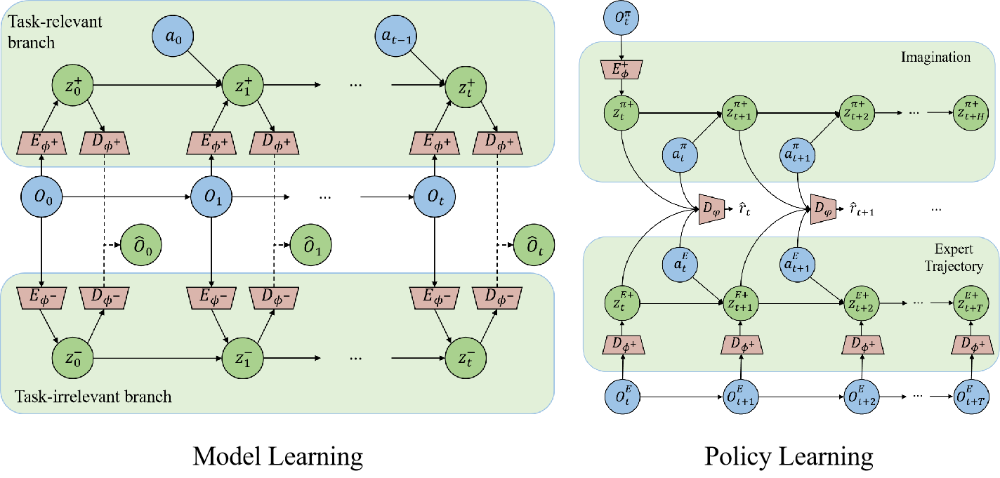

# Learning separated models and imaging for visual imitation learning (SeMAIL)
The official implementation of SeMAIL.

- [Datasets in this work][data]

[data]: https://drive.google.com/drive/folders/1iI3fFvDEeOAx52idH0IF1yX8jIVuBhDw?usp=share_link

## Method

**SeMAIL**



## Example usage


```
conda env create -f SeMAIL.yaml
conda activate SeMAIL
```

To train agents for each environmnet download the expert data from the provided link and run:

```
# car racing
python -u SeMAIL.py --expert_dir ../data/car_racing_expert --steps 500000 --seed 2021 --image_size 64 --batch_size 64 --task gym_car_racing_none-none --video_datadir ../driving_car_16/driving_car_16 --log_dir logdir/SeMAIL  --disen_rec_scale 1.0
# locomotion tasks
python -u SeMAIL.py --expert_dir ../data/walker_run_expert --steps 1000000 --seed 2021 --image_size 64 --batch_size 64 --task dmc_walker_run_driving-driving --video_datadir ../driving_car_16/driving_car_16 --log_dir logdir/SeMAIL  --disen_rec_scale 0.25
```

To train agents for each environmnet from expert demonstration data with different video backgrounds, run:

```
python -u SeMAIL.py --expert_dir ../data/walker_run_expert-8 --steps 1000000 --seed 2021 --image_size 64 --batch_size 64 --task dmc_walker_run_driving-driving --video_datadir ../driving_car_16/8 --log_dir logdir/SeMAIL-8  --disen_rec_scale 0.25

```

The training plots and output visualizations will be in the log folder:

```
tensorboard --logdir logdir
```

## Acknowledgement

We appreciate the following github repos where we borrow code from:

https://github.com/rmrafailov/VMAIL

https://github.com/kyonofx/tia